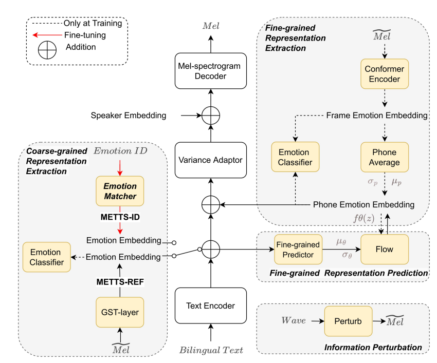

# MelsTTS - PyTorch Implementation (wip)
MELS-TTS : Multi-Emotion Multi-Lingual Multi-Speaker Text-to-Speech System via Disentangeld Style Token

A PyTorch implementation of [**MELS-TTS : Multi-Emotion Multi-Lingual Multi-Speaker Text-to-Speech System via Disentangeld Style Token**](https://ieeexplore.ieee.org/document/10446852). 




# Updates
- 2025/6/30: First Initial Commit
- 2025/7/16: Compelete Inference code

## Dependencies
We recommend using a Python 3.10 environment.

You can install the Python dependencies with
```
pip install -r requirements.txt
```

## PreProcessing
```
python prepare_align.py
```
```
mfa
```
```
python preprocess_esd.py
```

## Training
```
python train.py
```

## Inference
```
python inference.py
```

## Todo

- [x] FastSpeech2 backbone
- [x] style tokens
- [x] distangel style tokens
- [ ] inference.py #remain

# References
- [ming024's FastSpeech2 implementation]https://github.com/ming024/FastSpeech2)
- [KinglittleQ's GST implementation]https://github.com/KinglittleQ/GST-Tacotron)

# Citation
```
@article{ren2020fastspeech2,
  title={Fastspeech 2: Fast and high-quality end-to-end text to speech},
  author={Ren, Yi and Hu, Chenxu and Tan, Xu and Qin, Tao and Zhao, Sheng and Zhao, Zhou and Liu, Tie-Yan},
  journal={arXiv preprint arXiv:2006.04558},
  year={2020}
}

@inproceedings{Wang2018GST,
  author={Wang, Yuxuan and Stanton, Daisy and Zhang, Yu and Ryan, RJ-Skerry and Battenberg, Eric and Shor, Joel and Xiao, Ying and Jia, Ye and Ren, Fei and Saurous, Rif A},
  title     = {Style tokens: Unsupervised style modeling, control and transfer in end-to-end speech synthesis},
  booktitle = {Proc. 35th Int. Conf. Mach. Learn.},
  pages     = {5167--5176},
  year      = {2018}
}
